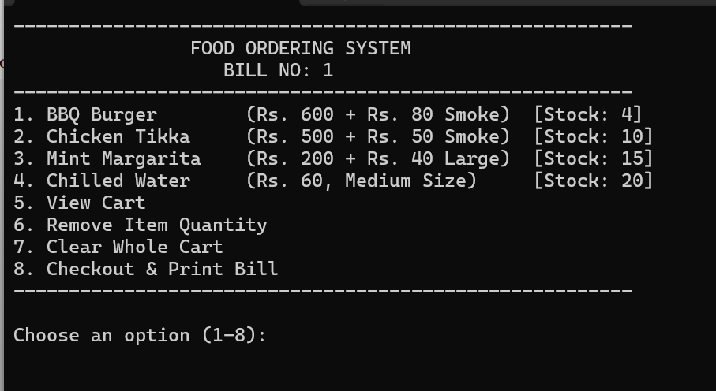
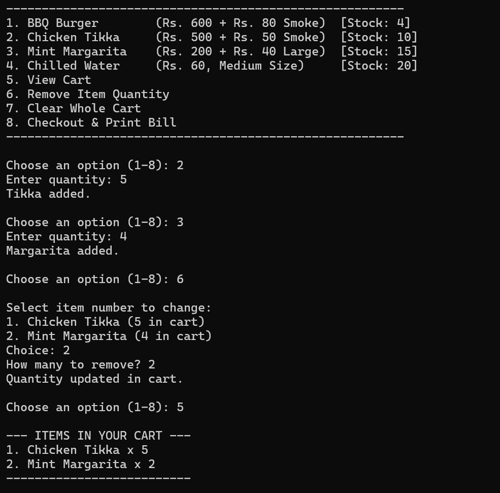
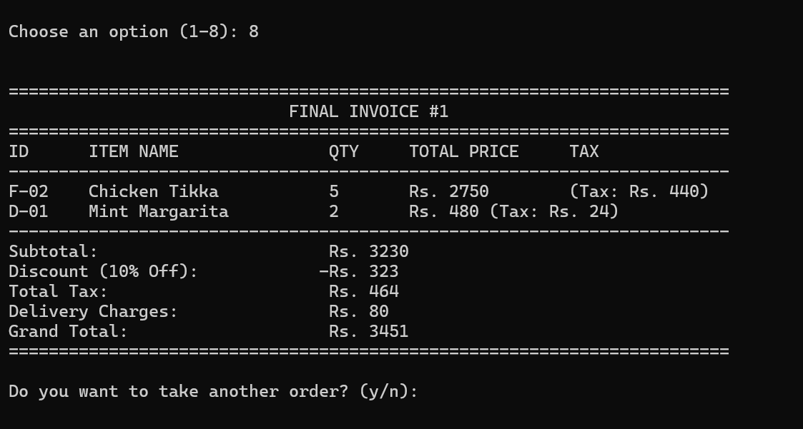

# Online Food Ordering System

A console-based Food Ordering System implemented in C++ utilizing Object-Oriented Programming (OOP) principles. The system allows users to browse a dynamic menu, manage a shopping cart (add, update quantity, remove, or clear), track real-time stock availability, and generate polymorphic, fully taxed final invoices.

---

## 🚀 Features

* **Object-Oriented Architecture:** Implements polymorphism, inheritance, and encapsulation using an abstract base class (`MenuItem`) and specialized derived classes (`SmokedFood`, `Drink`).
* **Dynamic Cart Management:** Add items to the cart, dynamically adjust or remove specific item quantities, or wipe the cart clean while automatically syncing with active inventory stocks.
* **Real-time Stock Management:** Keeps track of item stock limits and auto-adjusts cart quantities if user requests exceed current availability.
* **Polymorphic Calculations:** Computes custom price structures, item-specific taxes (16% for smoked foods, 5% for beverages), and automated discounts (10% off for subtotals over Rs. 1000).
* **Dynamic Memory Management:** Safely allocates and destroys dynamic objects (`new`/`delete`) preventing memory leaks across multiple billing sessions.

---

## 🛠️ System Architecture

### Class Hierarchy
* **`MenuItem` (Abstract Base Class):** Standardizes identity elements (`id`, `name`, `price`, `qty`) and forces derived classes to evaluate calculations via pure virtual functions.
* **`SmokedFood` (Derived):** Factoring in extra smoke charges and a 16% sales tax rate.
* **`Drink` (Derived):** Features contextual pricing based on size definitions ("Large" premium vs "Medium" base) and a 5% beverage tax rate.

---

## 📸 Application Walkthrough & Output

### 1. Main Menu and Inventory Status
Upon execution, the terminal displays the landing page containing available food items, distinct pricing tiers, exact real-time stocks, and administrative cart operations.



### 2. Dynamic Cart Management (Viewing & Modifying)
Users can view items currently held inside the cart array or choose to decrement/remove quantities. The program automatically returns the removed counts back to the live inventory variables.



### 3. Detailed Polymorphic Invoice Generation
Upon checkout, the polymorphic loop references `MenuItem` pointers to trigger the correct item-specific overriden calculations. It properly applies conditional discounts, taxes, and finalizes a clean tabular receipt.



---

## 💻 How To Run

1.  **Clone the repository:**
    ```bash
    git clone [https://github.com/YOUR_USERNAME/online-food-ordering-system.git](https://github.com/YOUR_USERNAME/online-food-ordering-system.git)
    cd online-food-ordering-system
    ```

2.  **Compile the code:**
    Use any standard C++ compiler (like `g++`):
    ```bash
    g++ -o food_system main.cpp
    ```

3.  **Run the application:**
    ```bash
    ./food_system
    ```

---

## 📝 Technologies Used

* **Language:** C++ (Standard ISO/IEC 14882)
* **Concepts:** Dynamic Polymorphism, Virtual Destructors, Pointer Arrays, Encapsulation, Stream I/O.